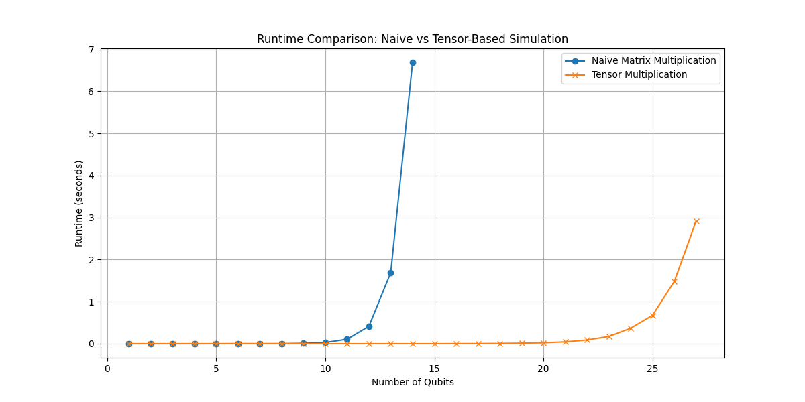
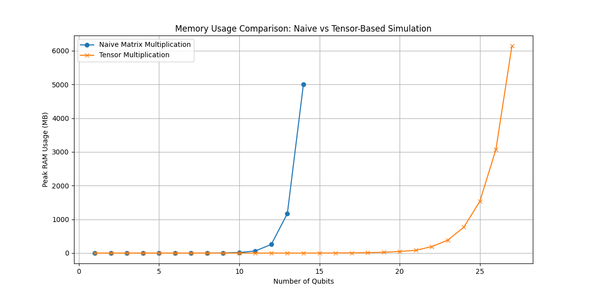

# Task 1: Statevector Simulation of Quantum Circuits

For this task, you will implement a statevector simulator for quantum circuits from scratch. The goal is to demystify how to simulate a quantum computer and to demonstrate your familiarity with quantum circuits.

## 1) Naive Simulation Using Matrix Multiplication

Remember that $[1, 0] = |0\rangle$ is the most common representation of the single-qubit zero state, and analogously $[0, 1] = |1\rangle$.

Most matrix representations of quantum gates you can find online follow this convention. For example, the X gate can be written as:

$$
X = \begin{bmatrix}
0 & 1 \\
1 & 0
\end{bmatrix}
$$

Using the Kronecker product and the `np.kron` function in NumPy (we are using it as an example, but you can use any library you want to), you can create a vector of length $2^n$ representing an n-qubit quantum state, and matrix representation of X, H, and CNOT gates.

*Hint:* The single-qubit Identity matrix is:

$$
I = \begin{bmatrix}
1 & 0 \\
0 & 1
\end{bmatrix}
$$

Define a quantum circuit consisting of these gates and apply the gates sequentially to the statevector via matrix multiplication.

### Task

Plot the runtime of your code as a function of the number of qubits. How many qubits can you simulate this way?

## 2) Advanced Simulation Using Tensor Multiplication

Tensors are generalizations of vectors and matrices to any number of dimensions. Instead of representing an n-qubit state as a vector of length $2^n$, it may be more natural to write it as an n-dimensional tensor of shape $(2, 2, \ldots, 2)$. The transformations between these two representations are naturally possible via `np.reshape` and `np.flatten`.

Using tensor multiplication and the `np.tensordot` (or `np.einsum`) function, you can apply a gate to the quantum state by multiplying the 1- or 2-qubit matrices with the state tensor along the corresponding qubit axes.

Define a quantum circuit consisting of the 1- and 2-qubit matrix representations of X, H, and CNOT (same as above) and apply them sequentially to the quantum state tensor via tensor multiplication.

### Task

Plot the runtime of your code as a function of the number of qubits. How many qubits can you simulate this way? Compare your results to subtask 1.

## Result

### Runtime Comparison: Naive vs Tensor-Based Simulation
The runtime plot reveals that **naive matrix multiplication** becomes impractical as qubit count increases, with a sharp rise in runtime limiting it to around 12-14 qubits. In contrast, **tensor multiplication** scales more efficiently, allowing simulations up to 27 qubits with lower runtime, although it still grows exponentially, just at a slower rate.

### Memory Usage Comparison
Memory usage reflects similar scalability limits. Naive multiplication's memory demands grow rapidly, restricting it to around 14-16 qubits, while tensor multiplication uses less memory, supporting larger qubit systems more effectively.

