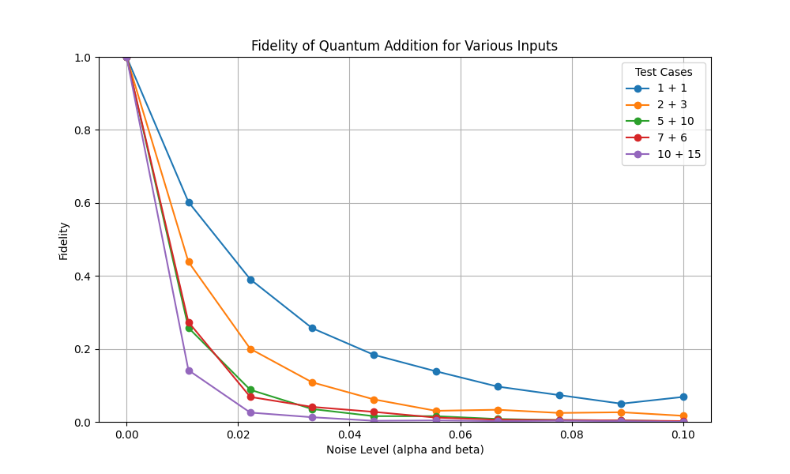
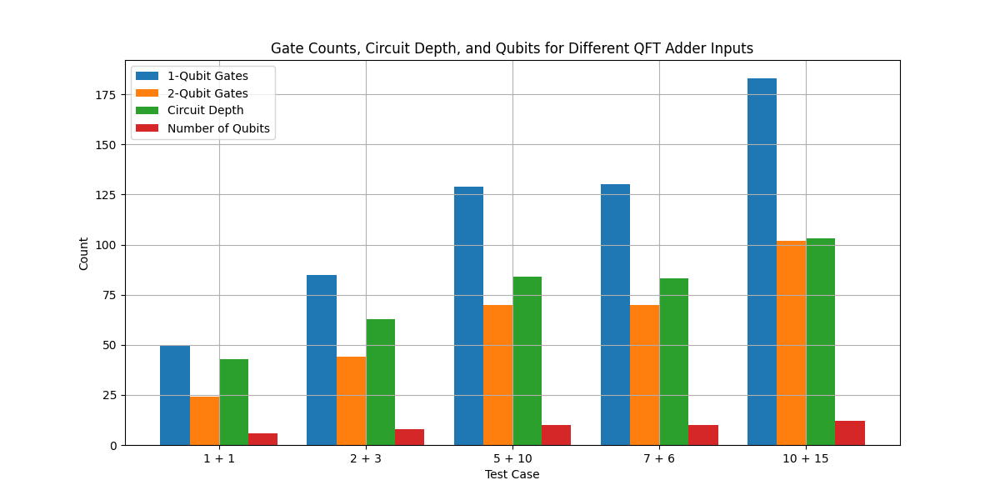
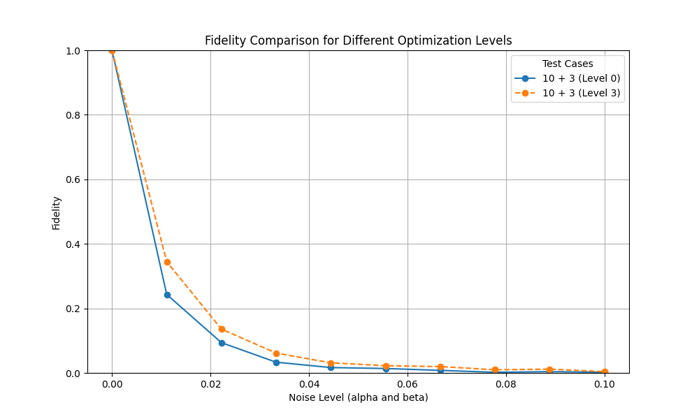

# Task 2: Noise, Noise, and More Noise

One of the main challenges in quantum computing is the noise in current devices. In this task, you will create a simple noise generator and assess its effect. You can use any framework you like (Qiskit, Cirq, etc.).

### 1. Noise Model
A standard way to represent the noise in a quantum circuit is through Pauli operators ($\sigma_x$, $\sigma_y$, $\sigma_z$). Build a function with input $\alpha$, $\beta$, and `QuantumCircuit` where:

- $\alpha$: Probability of having a random Pauli operator acting on the qubit after a one-qubit gate.
- $\beta$: Probability of having a random Pauli operator acting on the qubit after a two-qubit gate.
- `QuantumCircuit`: Quantum circuit where the noise will be added.

The output should be the `QuantumCircuit` with noise.

### 2. Gate Basis
Quantum computers can implement only a set of gates that, with transformations, can represent any other possible gate. This set of gates is called the Gate Basis of the QPU. Build a function that transforms a general `QuantumCircuit` to the following gate basis: `{CX, ID, RZ, SX, X}`.

### 3. Adding Two Numbers with a Quantum Computer
Build a function (`quantum_sum`) to add two numbers using the Draper adder algorithm. You will need the Quantum Fourier Transform (QFT). Many libraries offer a function to use it. For this task, you will need to build QFT from scratch.

### 4. Effects of Noise on Quantum Addition
Now, we can combine all the functions. Transform the circuit used in the `quantum_sum` to the gate basis and add noise. Use different levels of noise and analyze the results.

- How does the noise affect the results?
- Is there a way to decrease the effect of noise?
- How does the number of gates used affect the results?

### References:
- [3] Quantum arithmetic with the Quantum Fourier Transform: [https://arxiv.org/pdf/1411.5949.pdf](https://arxiv.org/pdf/1411.5949.pdf)

## 1) Noise Model
Define a function to add noise to a quantum circuit:

## 2) Gate Basis Transformation
Transform the circuit to use a specific gate set:

## 3) Adding two numbers with a quantum computer
Build a QFT adder for adding two numbers:

## 4) Effects of noise on quantum addition
Simulate the quantum adder with noise:

### How does the noise affect the results?

Noise quickly lowers fidelity, especially for larger sums, as you can see from the plots below. Smaller sums (like 1 + 1) handle noise better, while larger sums (like 10 + 15) drop in accuracy faster due to their increased complexity. More qubits, gates, and circuit depth mean more points where noise can introduce errors, making complex circuits more sensitive to noise.

 

### Is there a way to decrease the effect of noise?, How does the number of gates used affect the results?

There are several ways to decrease the effect of noise in quantum circuits, such as reducing the number of gates, decreasing the circuit depth, and changing the circuit layout. As shown in the plot below, using a higher optimization level (which reduces the number of gates and depth) results in better fidelity, especially at lower noise levels. This indicates that optimizing the circuit can make it more resilient to noise.
