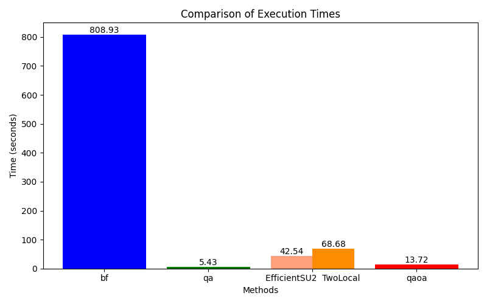

# Task 3: Optimization

In the [Bin Packing Problem (BPP)](https://en.wikipedia.org/wiki/Bin_packing_problem), given a collection of items, the goal is to efficiently pack the items into the minimum number of bins, where each item has an associated weight, and the bins have a maximum weight. This problem is common in industries like supply chain management, where multiple packages need to be loaded onto a truck, plane, or vessel. In this task, you will solve the BPP using quantum computing.

## 1) **From Integer Linear Programming (ILP) to Quadratic Unconstrained Binary Optimization (QUBO)**
   - Define the ILP formulation of the BPP. You can use [Docplex](https://qiskit-community.github.io/qiskit-optimization/tutorials/11_using_classical_optimization_solvers_and_models.html) or similar frameworks.
   - Create a function to transform the ILP model into a QUBO.
   - Test your function with specific instances (sizes: small, medium, and large).

## 2) **Create a Brute Force Solver for the QUBO Problem**
   - Solve the specific instances using a brute-force approach.

## 3) **Solve the QUBO Using Quantum Annealing Simulators**
   - Use the [Dwave Ocean Framework](https://docs.ocean.dwavesys.com/en/stable/) to solve the QUBO. Refer to this [example](https://www.dwavesys.com/media/fmtj2fw3/20210920_ofbguide.pdf) for guidance.

## 4) **Use a Quantum Variational Approach to Solve the QUBO**
   - Create multiple [Ansatz](https://pennylane.ai/qml/glossary/circuit_ansatz/) for testing.
   - Build a function with the input being the QUBO and Ansatz. Use a hybrid approach to solve the QUBO.

## 5) **Use [QAOA](https://arxiv.org/abs/1411.4028) to Solve the QUBO**
   - Create a QAOA function from scratch.

## 6) **Compare and Analyze the Results**
   - **What is the difference between QAOA, Quantum Annealing, and Quantum Variational approaches with different Ansatz?**
      - Quantum Annealing is a fully quantum approach with no classical optimization loop, relying on adiabatic evolution to find the ground state of a problem Hamiltonian. It runs on quantum annealers like D-Wave and is typically used for solving QUBO and Ising model problems. While it theoretically finds the solution as $ T \to \infty $, in practice, longer timescales can reduce the likelihood of finding the optimal solution, as the success probability is not monotonic with time.
      - QAOA is a hybrid approach that alternates between problem-specific and mixer Hamiltonians. It uses a classical optimization loop to tune the parameters of the quantum circuit, making it suitable for solving combinatorial optimization problems. Unlike Quantum Annealing, QAOA allows for adjustable precision, as increasing the circuit depth can improve the solution's accuracy.
      - Quantum Variational Approaches is also a hybrid approach. I think it’s a worse version of QAOA for solving combinatorial optimization problems, but maybe more flexible? You can design your own Ansatz the way you want or even come up with more robust algorithms than QAOA, but normally, it performs worse.

   - How do the results compare with the brute-force approach?
      - The brute-force (bf) approach is significantly slower than the other methods, taking 4722.85 seconds, but it explores all possibilities, ensuring the highest correctness. Quantum annealing (qa), simulated here with simulated annealing, is much faster (14.73 seconds) and also produces correct solutions. QAOA, taking 62.19 seconds, provided some answers, but they were not correct. Quantum variational approaches (EfficientSU2 and TwoLocal) were slower (206.57 and 1165.29 seconds, respectively) and failed to produce a solution. Both QAOA and the quantum variational approaches rely on classical optimization, making them less efficient in this context.

