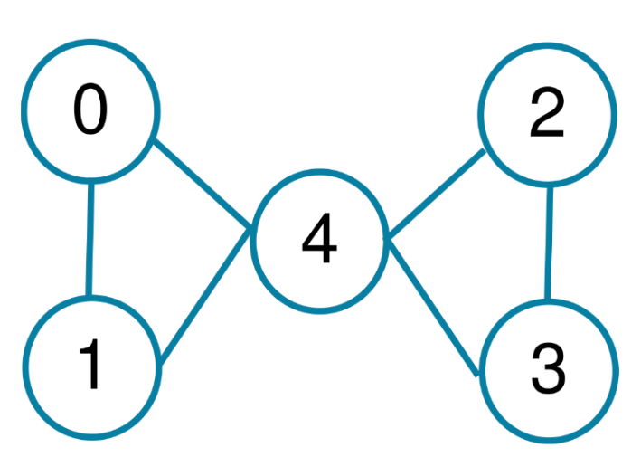
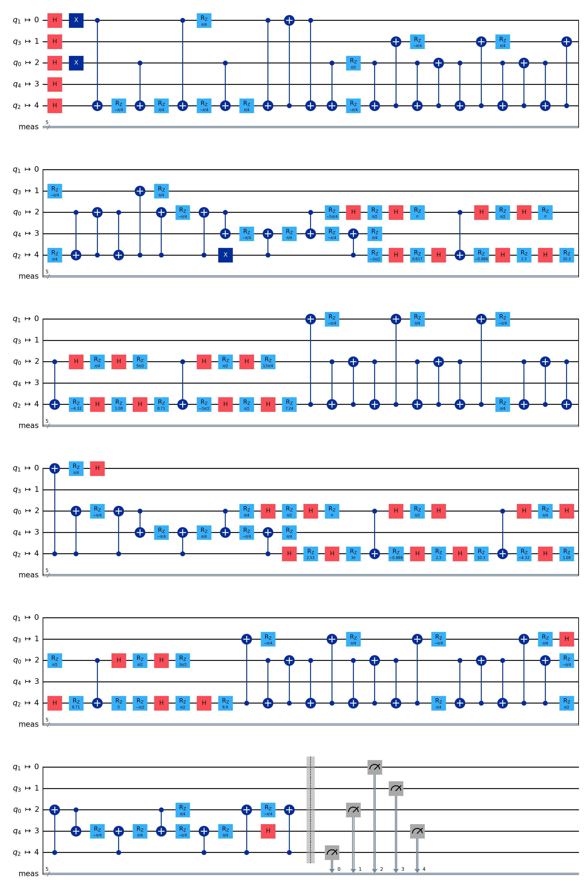
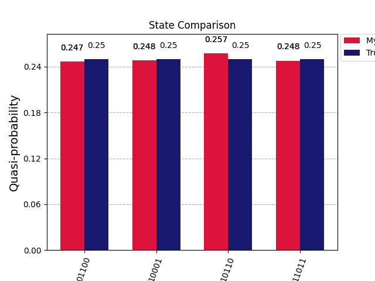
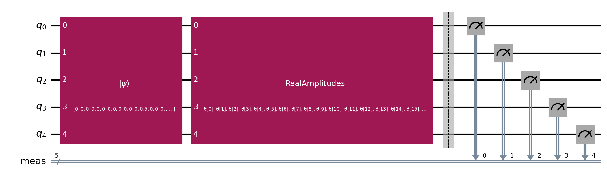
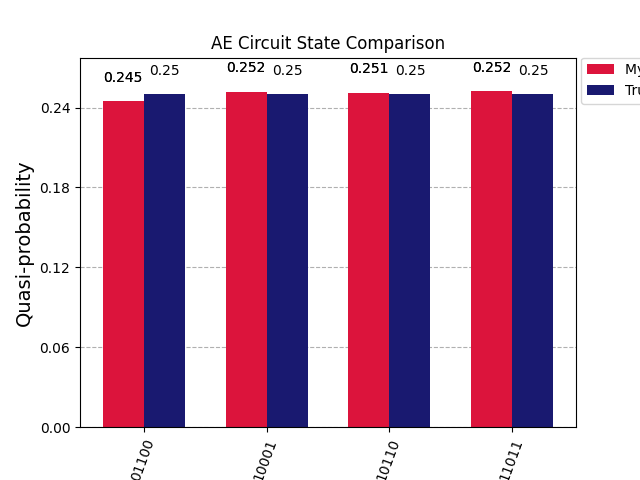
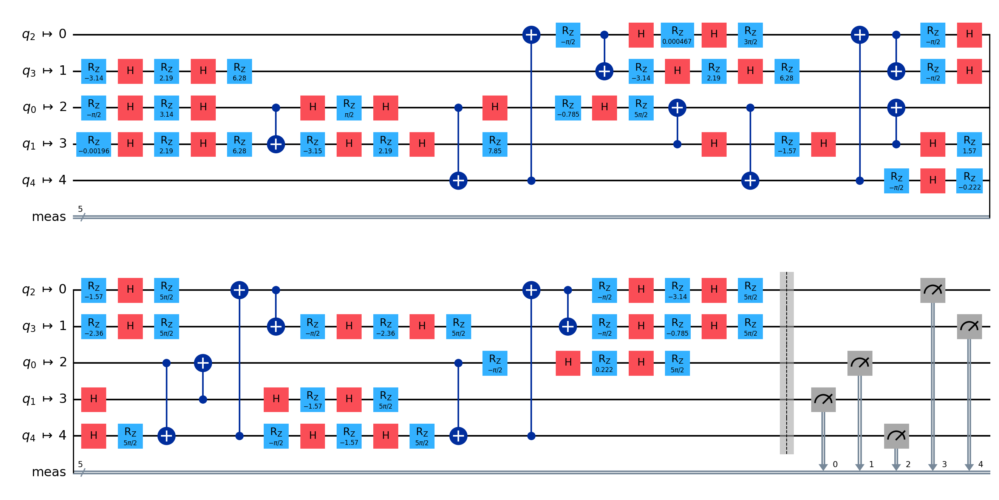
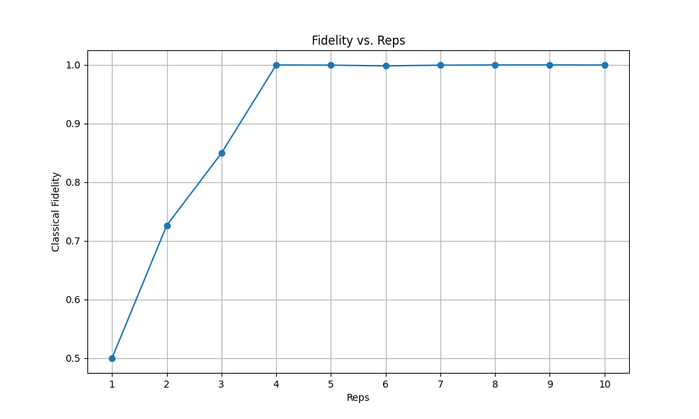
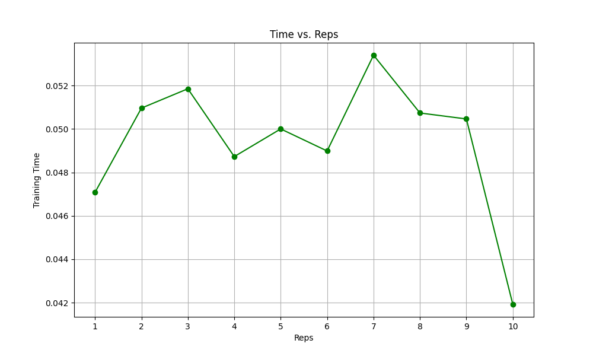
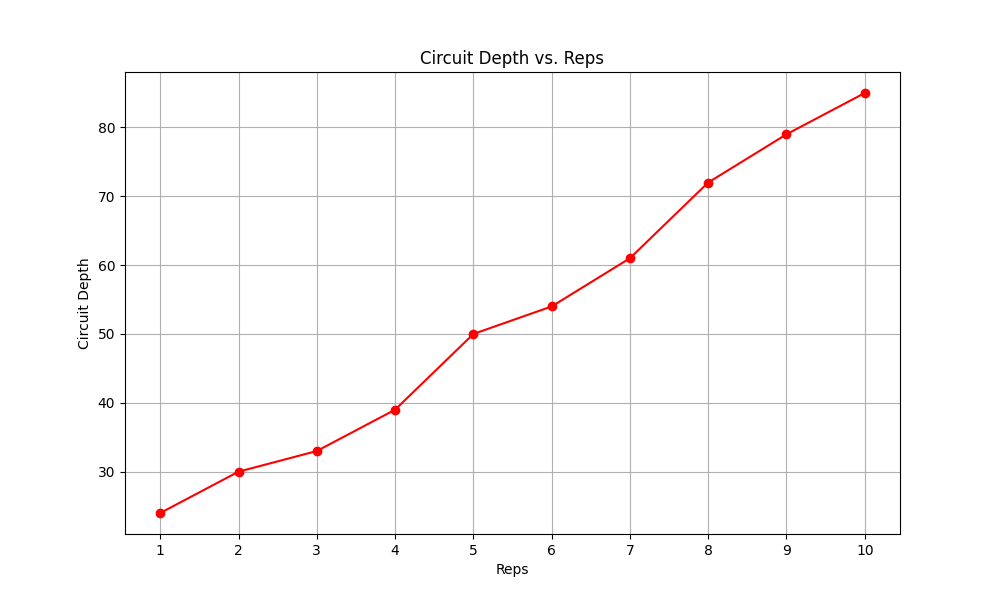

# Task 4: Decomposition

A common challenge in the design and implementation of quantum circuits is that they become too extensive and complex due to the large number of qubits required.

The number of quantum operations and the interdependence between qubits can further complicate the problem, making some traditional optimization methods ineffective or insufficient for reducing complexity. Additionally, as the number of qubits increases, the fidelity of the circuit may be affected, highlighting the need for advanced techniques to maintain operational precision.

While some quantum computing frameworks offer predefined optimization methods that may seem convenient, they are not always the best alternative if one has a deep understanding of the quantum hardware structure. Customizing circuits by leveraging the specific features of the quantum device in use can result in a more efficient design, better adapted to the physical limitations of the system. Thus, a solid understanding of the hardware can make the difference between a generic quantum circuit and one highly optimized for performance.

## Challenge

Consider the following code as input:

```python
import numpy as np

size = 5
state_values = [22, 17, 27, 12]

state_vector = [0]*2**size

for s in state_values:
    print(np.binary_repr(s, size))
    state_vector[s] = 0.5

np.asarray(state_vector)
```

Find a quantum circuit that represents the state vector with a depth of less than 50, using the basis gates `[x, h, rz, cx]` and the following architecture:

<br>
<br>

<br><br>

## Report

1. **Original Circuit**  
   The original circuit has a depth of 137. To reduce the circuit depth while maintaining high fidelity, a quantum autoencoder technique was applied, resulting in an optimized AE circuit with a depth of 39 and fidelity of 0.9999 to the original state.  
    <br>
    
    <br>

2. **State Comparison**  
   Compares the quantum states from the original circuit with the real target state.
   <br>
    
    <br>

3. **AutoEncoding (AE) Circuit Construction**  
   The AE circuit encodes the given data into quantum states.  
   <br>
    
    <br>

4. **State Comparison for AE**  
   Compares the state fidelity and distribution of the encoded states.  
   <br>
    
    <br> 

5. **Depth-39 Circuit with High Fidelity**  
   Constructs a quantum circuit of depth 39, achieving fidelity close to 0.9999.  
   <br>
    
    <br> 
   - `depth_39_fidelity_0.9999_circuit.qpy`: The `.png` file shows the circuit structure, and the `.qpy` file stores the quantum circuit data for further use.

6. **Fidelity Analysis**  
   Calculates and compares the fidelity of states across multiple repetitions.  
    <br>
    
    <br> 

7. **Time Analysis**  
   Measures the execution time for different repetitions.  
    <br>
    
    <br>   

8. **Depth Comparison**  
   Compares the circuit depth across different repetitions.  
   <br>
    
    <br>   
